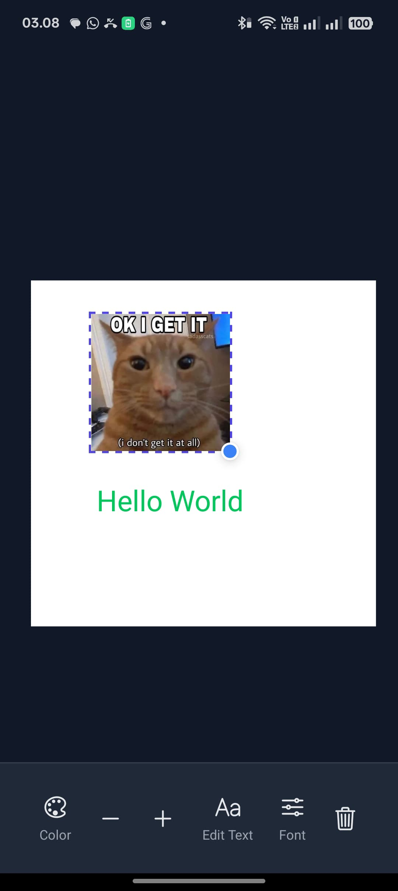
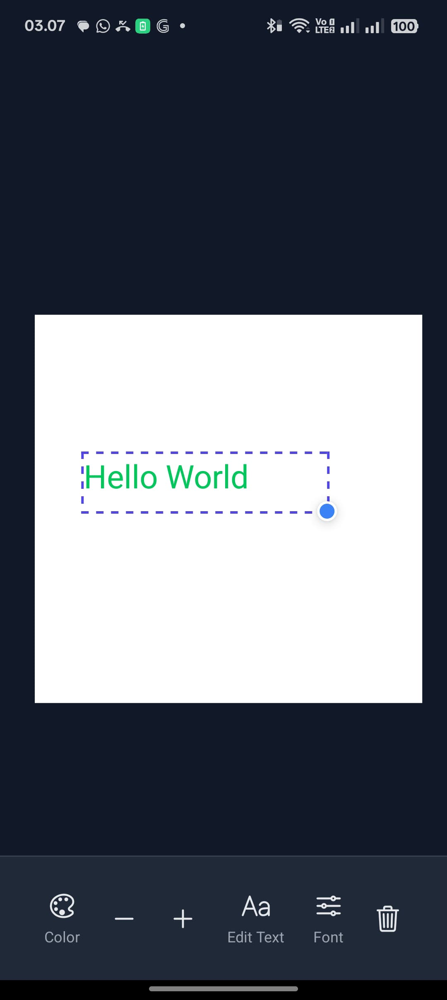
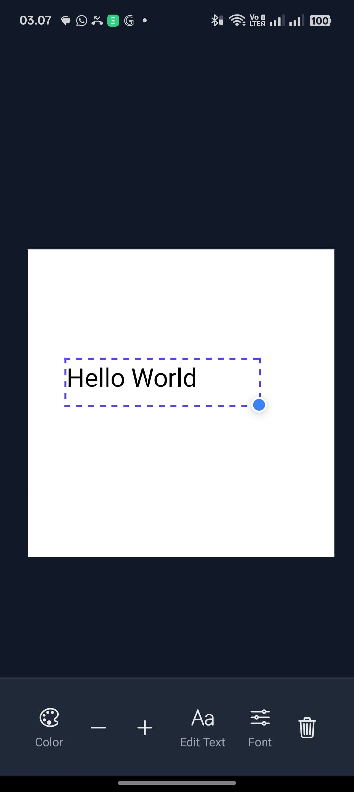
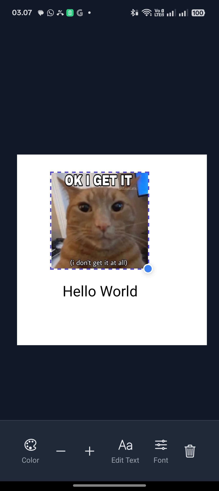
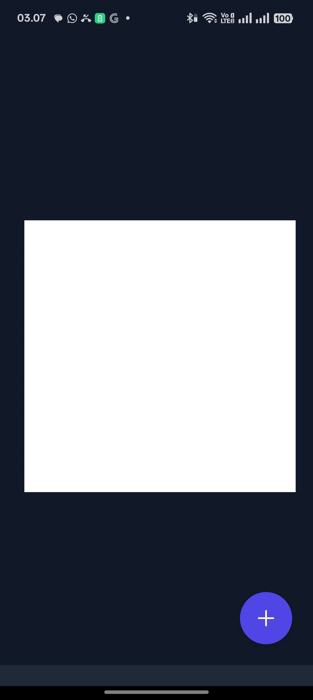

# Lahelu - Meme Editor App

Lahelu is a versatile and user-friendly mobile application built with React Native that allows you to create and edit memes right from your phone. With an intuitive interface, you can add text and images to a canvas, customize them to your liking, and let your creativity run wild.

## Features

-   **Interactive Canvas**: A dynamic canvas that supports pan and zoom gestures for easy navigation.
-   **Add Text**: Add text elements to your meme with customizable fonts, colors, and sizes.
-   **Add Images**: Select images from your device's photo library and add them to the canvas.
-   **Element Manipulation**:
    -   **Drag & Drop**: Move elements freely around the canvas.
    -   **Resize**: Easily resize both text and images while maintaining their aspect ratio.
    -   **Delete**: Remove any element with a single tap.
-   **Intuitive UI**: A clean and modern user interface with clear controls for a smooth editing experience.
-   **State Management**: Centralized state management using React Context for a reliable and predictable app state.

## App Showcase

Here are some screenshots showcasing the app's features:

| Add Elements | Edit Text |
| :---: | :---: |
|  |  |

| Add Image | Resize Image |
| :---: | :---: |
|  |  |

| Final Meme |
| :---: |
|  |

## Getting Started

To get a local copy up and running, follow these simple steps.

### Prerequisites

Make sure you have completed the [React Native - Environment Setup](https://reactnative.dev/docs/environment-setup) instructions.

### Installation

1.  Clone the repo
    ```sh
    git clone https://github.com/your_username/lahelu.git
    ```
2.  Install NPM packages
    ```sh
    npm install
    ```
3.  Link vector icon fonts
    ```sh
    npx react-native-asset
    ```

### Running the App

1.  Start the Metro server:
    ```sh
    npm start
    ```
2.  Run the app on your desired platform (in a separate terminal):
    -   For Android:
        ```sh
        npm run android
        ```
    -   For iOS:
        ```sh
        npm run ios
        ```

## Built With

-   [React Native](https://reactnative.dev/)
-   [TypeScript](https://www.typescriptlang.org/)
-   [React Native Gesture Handler](https://docs.swmansion.com/react-native-gesture-handler/)
-   [React Native Reanimated](https://docs.swmansion.com/react-native-reanimated/)
-   [React Native Image Picker](https://github.com/react-native-image-picker/react-native-image-picker)
